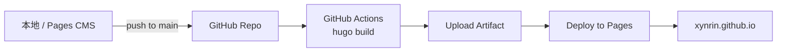
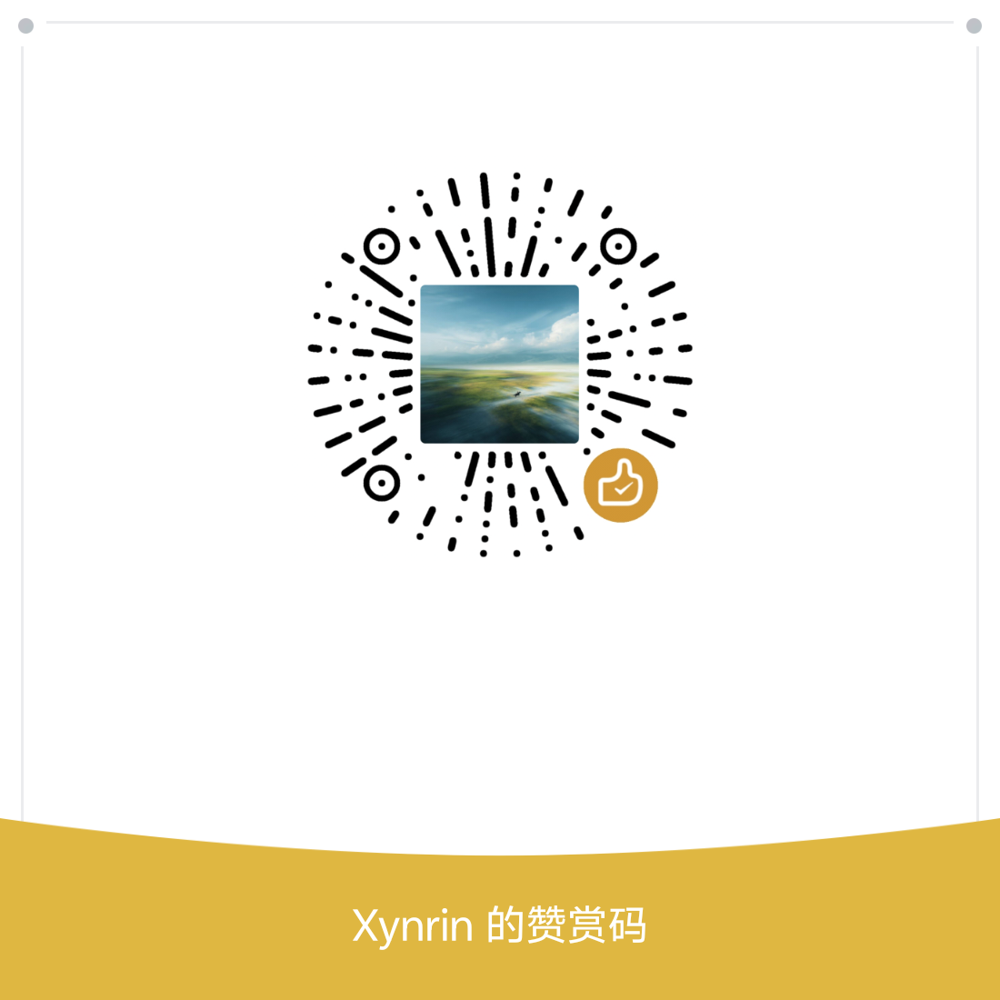

<div align="center">


# ✨ XYNRIN-BLOG

### *xynrin 的个人博客 · 一个安静记录的小角落*

<p>
  
  
  
  
</p>

<p>
  
  
  
  
  
</p>

[🌐 Live Site](https://xynrin.github.io) · [📝 写文章](https://app.pagescms.org) · [🐧 Linux.do](https://linux.do/u/xynrin/) · [✉ Email](mailto:xynrin@163.com)

---

</div>

## 🌟 关于本站

> 不喧哗，自有声。
>
> 这里记录我在 **代码 / 学习 / 折腾 / 生活** 中遇到的一切。

```text
   __  ___   ___  _ _____  ___  ____  __
   \ \/ / \_/ / |/ |  ___|/ _ \|  _ \|  |
    \  / \   /| ' /| |__ | |_| | |_) |  |
    /  \  | | |  / |  __||  _  |  _ <|__|
   /_/\_\ |_| |_|\_|_|   |_| |_|_| \_|__|
```

## ✨ 站点特性

| 模块 | 实现 |
| :--- | :--- |
| 🚀 静态生成 | Hugo extended v0.161+ |
| 🎨 主题 | [hugo-theme-stack](https://github.com/CaiJimmy/hugo-theme-stack) v4 |
| ☁ 部署 | GitHub Actions → GitHub Pages（自动） |
| 📝 后台 | [Pages CMS](https://pagescms.org) 网页可视化编辑 |
| 🔍 搜索 | 自研 fzf 风格模糊搜索 + 键盘导航（`/` 聚焦 · ↑↓ · Enter） |
| 💬 评论 | [Waline](https://waline.js.org/)（评论 + 点赞 + 浏览量） |
| 📊 统计 | 不蒜子（PV/UV）+ Waline 单篇浏览量 |
| 🌗 主题切换 | 跟随系统 / 手动切换 |
| 📡 RSS | 全文订阅 + 二维码 widget |
| 🧮 公式 | KaTeX 自动渲染 |
| 📈 图表 | Mermaid 自动识别 |
| 🖼 图片 | PhotoSwipe 点击放大 |
| ⏱ 运行时间 | 实时计时（精确到秒） |
| 🚀 阅读体验 | 顶部进度条 / 回到顶部 / TOC 高亮 / 字数统计 |
| 🎨 视觉 | 霓虹渐变 + 卡片色条循环 + Hero 大标语 + 故障 404 |

## 📊 站点统计

<p align="center">
  
  
</p>

<p align="center">
  
  
  
  
</p>

<p align="center">
  
  
  
  
</p>

<p align="center">
  
</p>

> 上方所有徽章数据均**实时**：README/仓库浏览次数会随访问递增，GitHub 数据每几分钟刷新一次。
>
> 全站 **PV/UV** 由 [不蒜子](https://busuanzi.ibruce.info) 统计（无公开 API），数字会出现在站点页脚。
> 单篇文章 **浏览量与点赞** 由 [Waline](https://waline.js.org) 统计，显示在每篇文章顶部。

## 🛠 本地开发

```bash
# 克隆（带 submodule）
git clone --recurse-submodules https://github.com/Xynrin/Xynrin.github.io.git
cd Xynrin.github.io

# 启动本地预览（默认 1313）
hugo server --buildDrafts

# 新建一篇文章
hugo new content post/your-post-name/index.md
```

## ⚙ 配置 Waline 后端（一次性）

1. Fork [Waline 模板仓库](https://github.com/walinejs/waline)
2. 一键部署到 [Vercel](https://vercel.com)（免费）
3. 在 Vercel 项目设置里添加环境变量：`LeanCloud APP ID / KEY / MASTER_KEY`（在 [LeanCloud](https://console.leancloud.cn) 创建免费应用）
4. 把 Vercel 给的 URL 填到 `hugo.yaml` 的 `params.comments.waline.serverURL`
5. 推送即生效

## ☁ 自动部署流程



## 📂 目录结构

```
.
├── .github/workflows/        # GitHub Actions 部署工作流
├── archetypes/               # 文章模板
├── assets/                   # 经 Hugo 处理的资源
│   ├── icons/                # 自定义 SVG 图标 (linuxdo / mail)
│   ├── img/                  # 图片资源 (avatar / favicon / banner / 赞赏码)
│   └── scss/custom.scss      # 自定义样式（霓虹渐变 / fzf 搜索 / 故障 404 / 打赏...）
├── content/                  # 所有文章和页面
│   ├── about/                # 关于页
│   ├── post/                 # 文章
│   ├── archives/             # 归档页
│   └── search.md             # 搜索页
├── layouts/                  # 自定义模板覆盖
│   ├── 404.html              # 故障霓虹 404
│   ├── home.html             # 含 hero + 文章列表
│   ├── single.html           # 含打赏 + Waline
│   ├── index.json            # 搜索索引
│   ├── page/search.html      # fzf 搜索 UI
│   └── _partials/            # head/footer/sidebar/widget/article 自定义
├── static/                   # 原样复制的静态文件
├── themes/hugo-theme-stack/  # 主题（git submodule）
├── .pages.yml                # Pages CMS 配置
├── hugo.yaml                 # Hugo 配置
└── LICENSE                   # GPL-3.0
```

## ☕ 打赏

如果这个项目或我写的文章帮到了你，欢迎请我喝杯咖啡：

<div align="center">
  
  <br/>
  <sub>感谢支持 ✨</sub>
</div>

## 📜 License

本仓库**源码部分**采用 [GNU General Public License v3.0](./LICENSE) 协议开源。

**文章内容**采用 [知识共享 署名-非商业性使用-相同方式共享 4.0 国际许可协议（CC BY-NC-SA 4.0）](https://creativecommons.org/licenses/by-nc-sa/4.0/deed.zh) 授权。

<div align="center">

---

<sub>Made with ❤ by <a href="https://github.com/Xynrin">xynrin</a> · 写于一个普通的下午</sub>

</div>
