检索互联网许久，发现自动化部署影视库很少，于是此文章诞生了

因为精力原因，可能出现表述错误，请见谅！

如果你是咸鱼购买的教程 不用担心 先确认咸鱼名称是不是**小韵无敌手**

如果图片加载失败请更换网路。

# 操作流程

## 1. 运行脚本，理解基础

首先我们使用 百度网盘  下载并解压 [飞牛媒体库一键安装](https://pan.baidu.com/s/1J0trciOGXLpXv4ogt6RP1w?pwd=xynb)

这时候我们得到了脚本和配置文件，使用scp命令将文件传入nas,scp命令如下:

```bash
# 作者本人使用的是fedora-linux系统 其他系统命令格式可能不一样
scp 本地文件路径 nas用户名@nas-ip:/要上传到nas对应的文件路径
```

通过ssh连接你的nas

找到刚刚上传的脚本，通过命令为脚本添加执行权限

运行脚本，并输入密码

此时脚本会自动拉取镜像，同时流式输入当前状态，等待脚本配置好后，会显示如图：

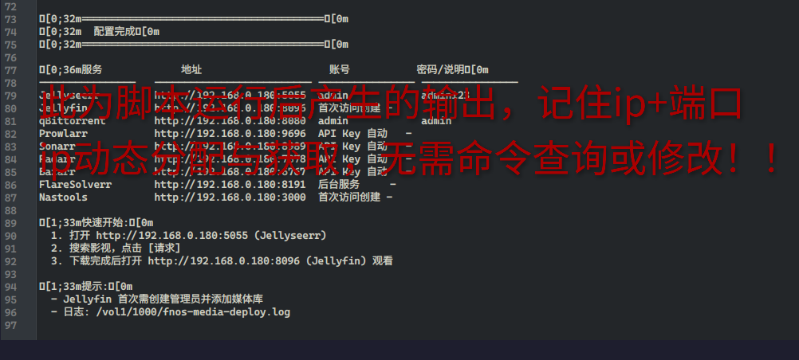

> 我们要记住 ip 和端口，这是后续配置的关键！！！

然后是脚本会自动创建显性（这里指 webui 默认打开文件管理器可查看）文件夹，如图：


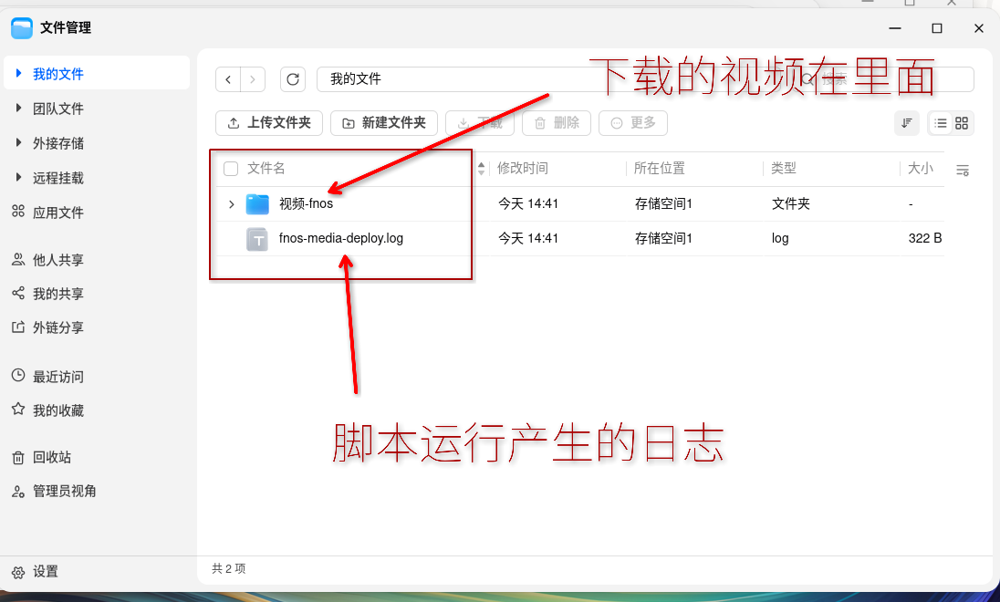

ps: 脚本拉镜像跑容器均用 root, 这样防止多用户产生的 docker 容器隔离（这样不方便管理）

# 2. 设置飞牛影视权限

首先确保你的飞牛 nas 下载了飞牛影视

然后按照下图操作：

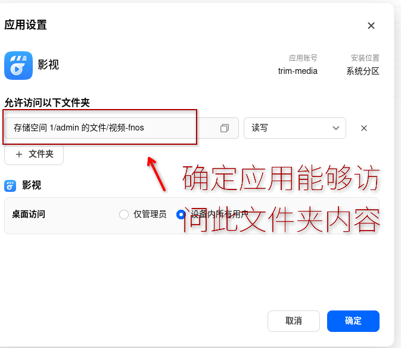

ps：因为脚本大量正则表达式过多，后续下载可能出现多个子文件夹情况（会导致视频无法显示，解决方法查看正确路径并在应用内设置对应路径，后续会规范文件路径）

# 3. webui 后台初始化设置

## 3.1 打开第一个 webui

首先我们打开第一个界面（确保是 jellyfin）

此时要求你设置用户名和密码之类的，一定要记住！！！

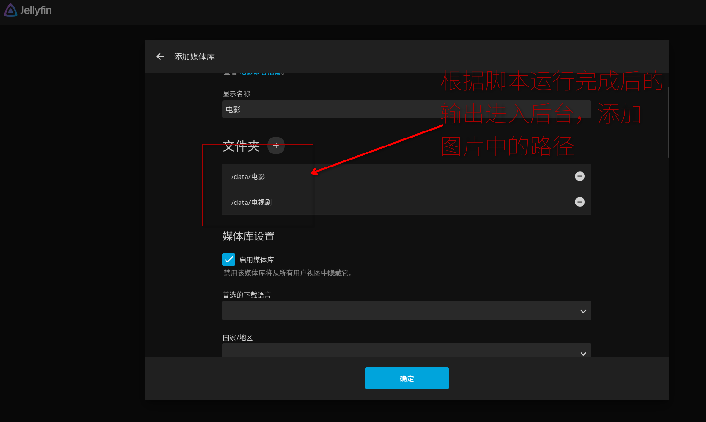

## 3.2 打开第二个界面

必须确保如图所示界面

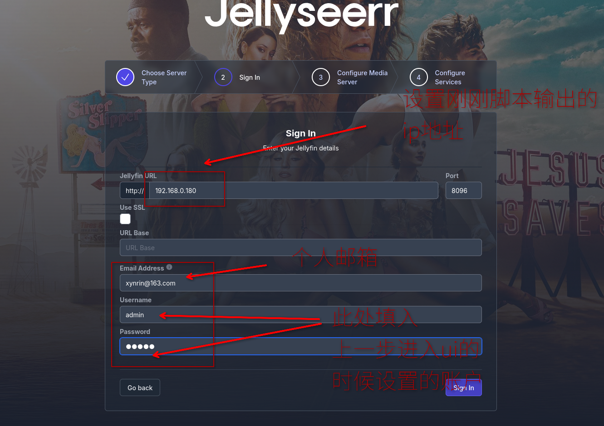

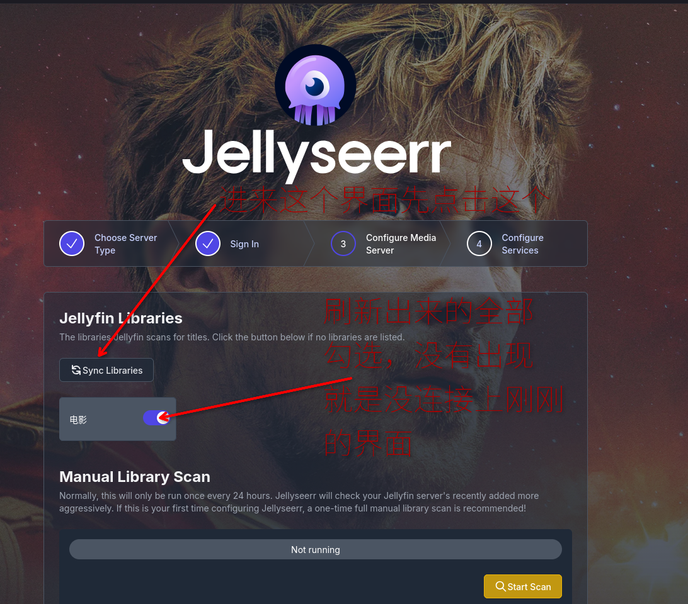

上个步骤完成后下滑界面，然后点击下一步

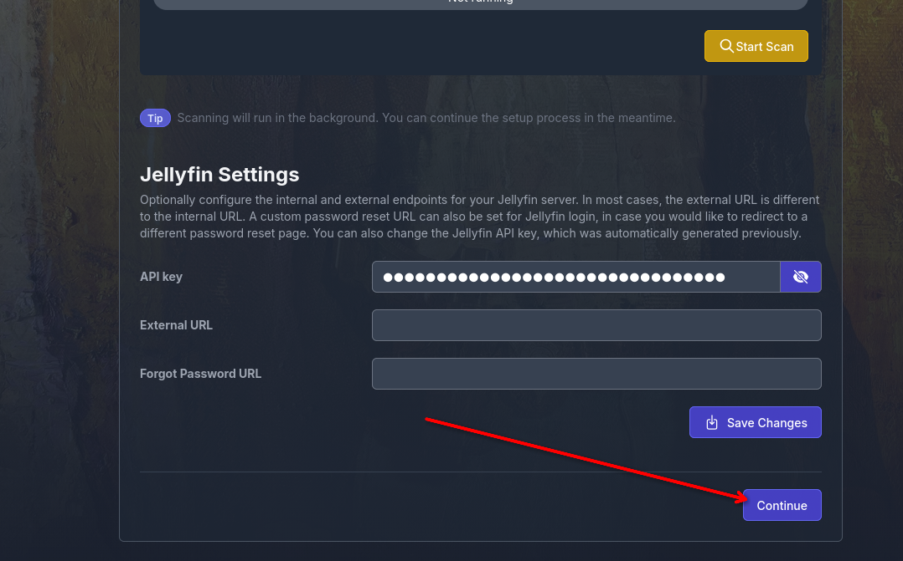

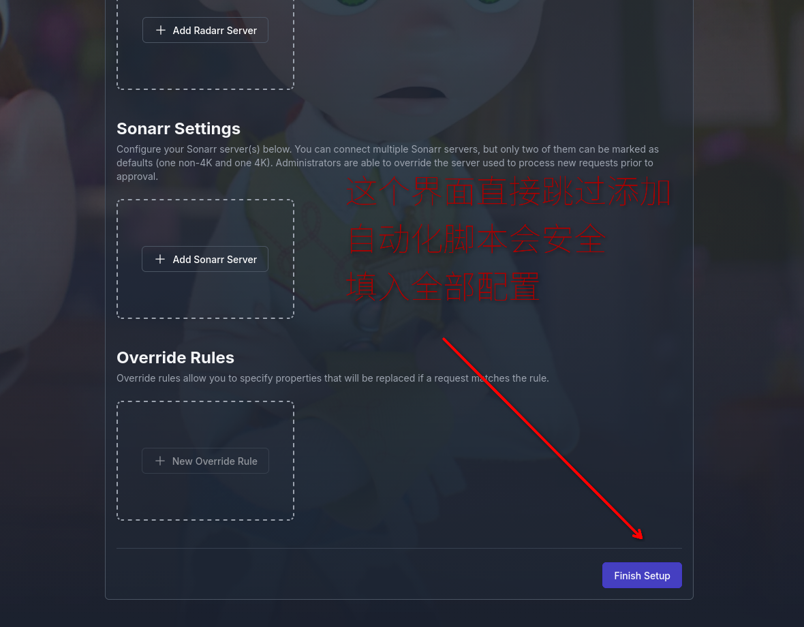

> 这里自动化脚本自动响应点击事件，自动带着你的 api 和 key 在安全的环境中配置和建立连接

# 4. 完成基础个人配置

## 4.1 语言切换

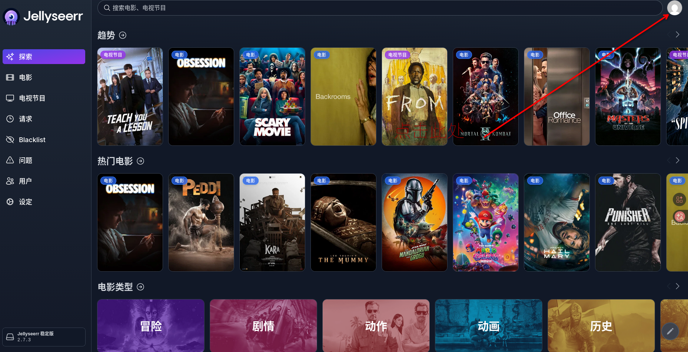

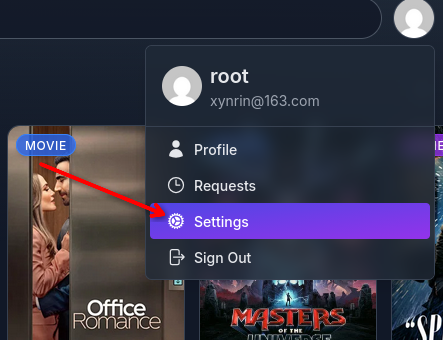

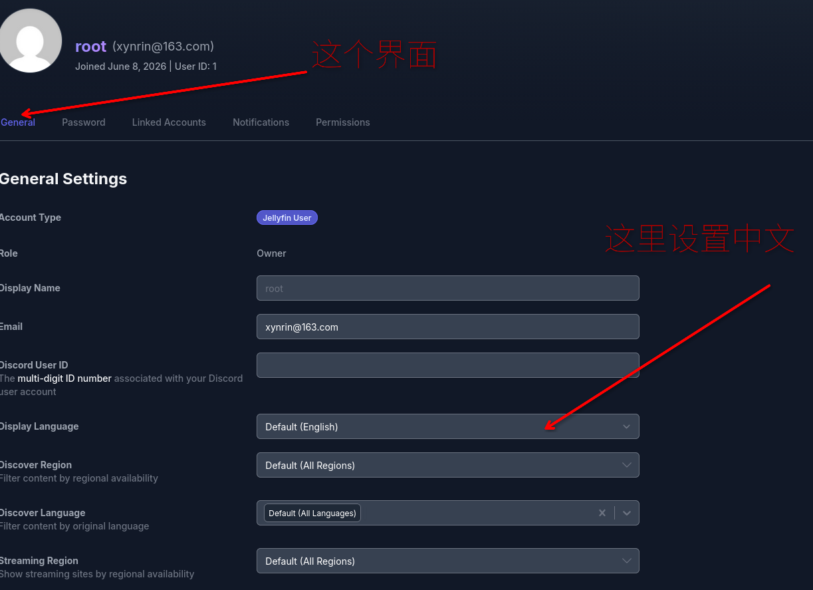

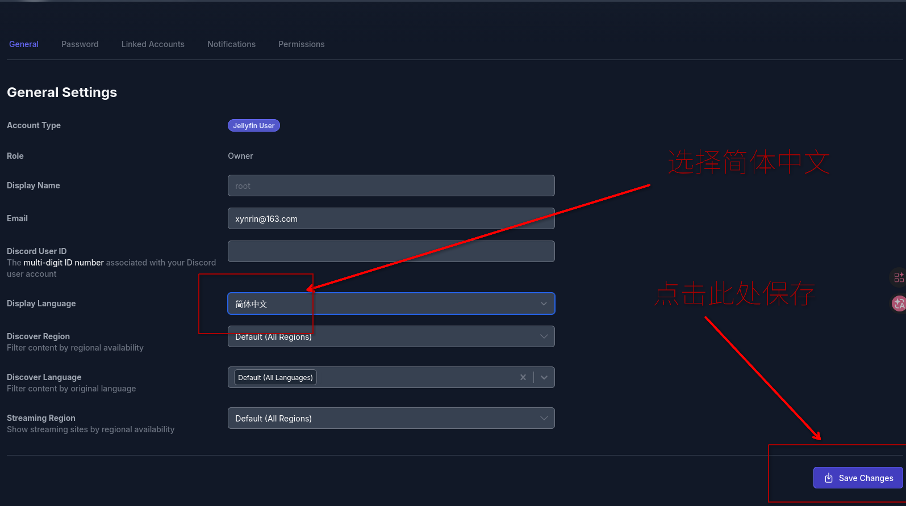

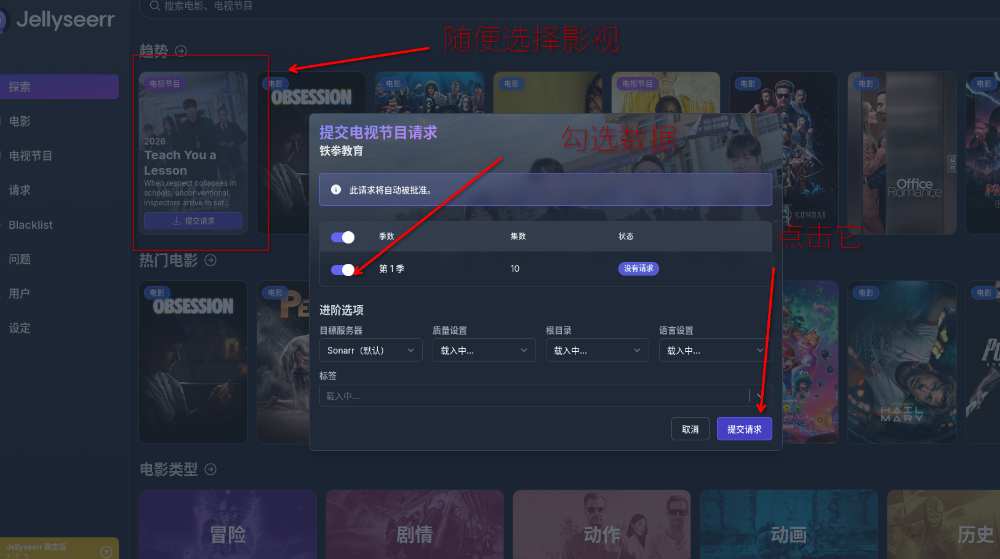

等待一会就好了

# 5. 效果展示

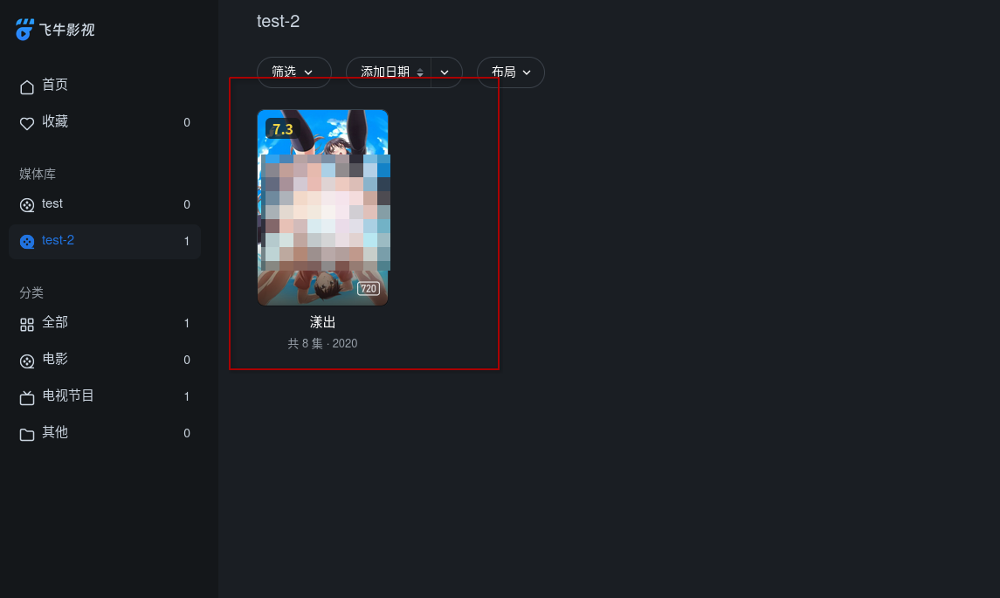

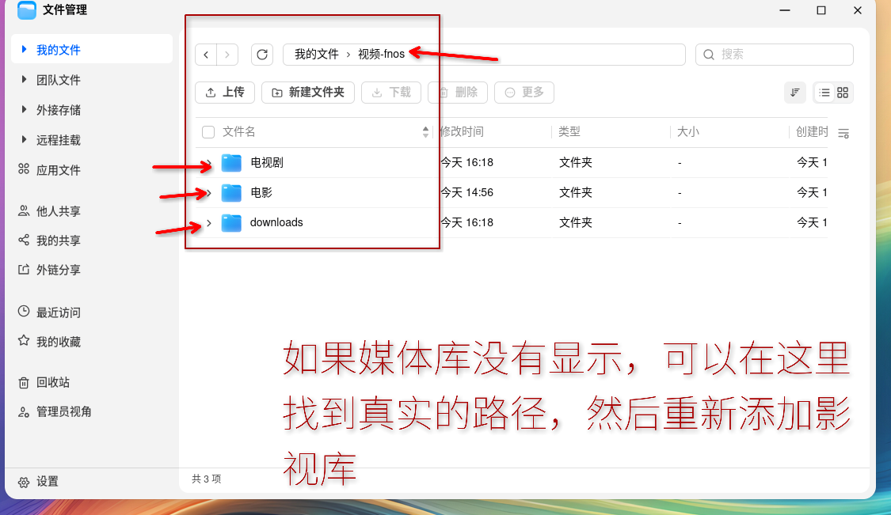

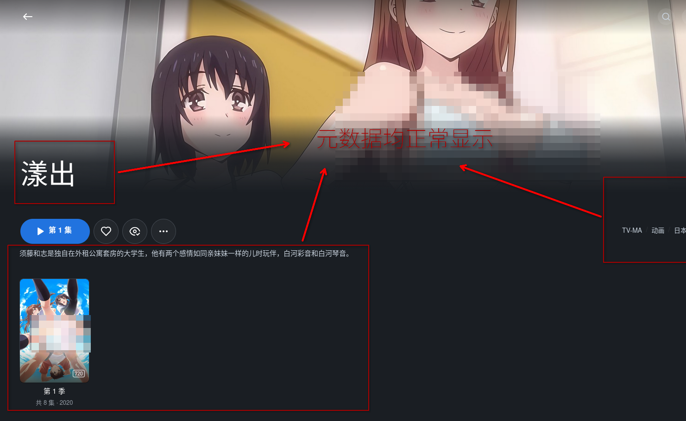


# 6. 作者的话

有什么想说的或者有疑惑的下方评论区留言或者联系我的邮箱！！！

