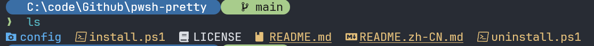
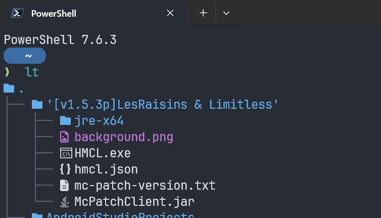
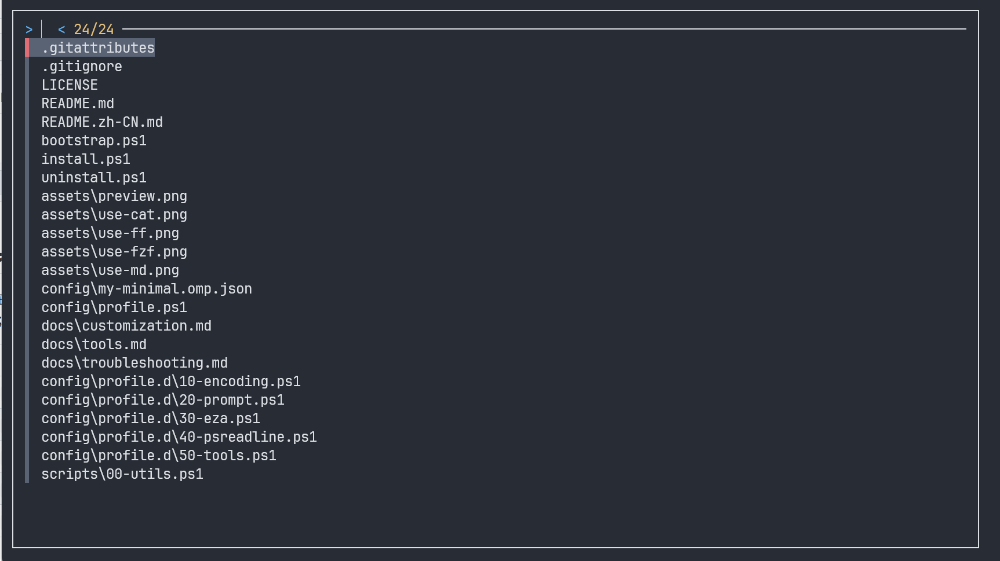
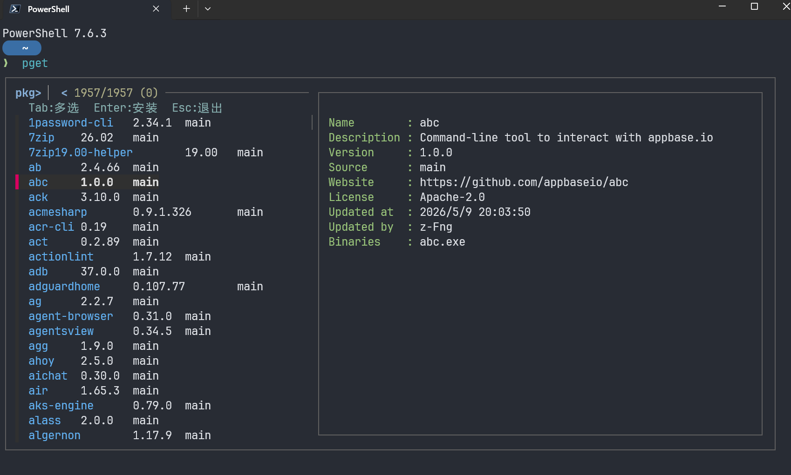
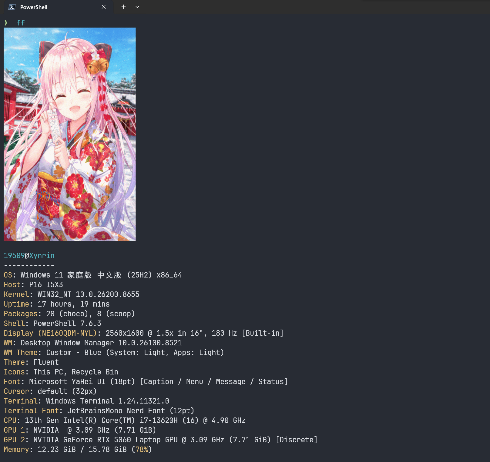

看烦了原生 PowerShell 朴素、单调的界面？想拥有类似 macOS/Linux 终端那样优雅的路径显示、Git 状态提示、行尾历史预测、带图标的 `ls` 以及模糊查找吗？

之前为了折腾这些，往往需要看好几篇教程，分别安装 `oh-my-posh`、`PSReadLine`、配置 `Terminal-Icons`、安装各种底层命令……不仅步骤繁多，还容易遇到中文乱码、包管理器网络受限等各种令人抓狂的坑。

为了“一劳永逸”地解决这些痛点，我开发了 **[pwsh-pretty](https://github.com/Xynrin/pwsh-pretty)** 这个一键配置项目。

只需运行一条命令，就能把你的 PowerShell 7 瞬间变身，颜值与效率直接拉满！

如果图片加载失败请更换网络。

---

## 📸 效果预览



- 路径包裹在彩色圆角胶囊里，不会和上一行命令的输出混在一起。
- 命令行提示符箭头会根据上一条命令的退出状态自动变色（**成功为绿，失败为红**）。
- 模块化设计，丢入一个配置文件就能轻松扩展。

---

## 🌟 核心特性

- 🎯 **极简两行提示符**：基于 oh-my-posh，完美显示当前路径与 Git 状态，干净不凌乱。
- 🎨 **带图标的 `ls`**：使用更现代的 `eza` 替换原有 `ls`，目录优先展示，且附带常用别名 `ll` / `la` / `lt`。
- ⌨️ **历史预测与补全**：灰字实时预览历史命令，按 `→` 键即可一键接受，效率飞起。
- 🈶 **完美支持 UTF-8**：启动时强制开启，彻底修复中文文件名和图标显示为 `□` 乱码的痛点。
- 🧰 **效率工具全家桶**：自动集成 fzf、bat、mdcat、zoxide、fastfetch 等增强工具。
- 📦 **内置 `pget` 包管理 TUI**：将 fzf 和 scoop / winget 临时联动，打造极致的终端包安装体验。
- ↩️ **安全且完全可逆**：安装时自动备份旧配置，卸载脚本可一键无缝还原。

---

## 🚀 安装步骤

在 Windows 11 / 10 下，打开 **PowerShell 7**。

### 1. 运行一键安装脚本（推荐）

```powershell
irm https://raw.githubusercontent.com/Xynrin/pwsh-pretty/main/bootstrap.ps1 | iex
```

> 💡 **首次运行可能需要开启脚本执行策略**：  
> `Set-ExecutionPolicy RemoteSigned -Scope CurrentUser`

如果你的网络访问 GitHub Raw 较慢，可以使用代理参数运行：
```powershell
$env:PWSH_PRETTY_PROXY='http://127.0.0.1:7897'
irm https://raw.githubusercontent.com/Xynrin/pwsh-pretty/main/bootstrap.ps1 | iex
```

### 2. 本地克隆安装（备用方式）
你也可以直接克隆仓库进行交互式选择：
```powershell
git clone https://github.com/Xynrin/pwsh-pretty.git
cd pwsh-pretty
.\install.ps1          # 交互式询问；支持 -All（全装）或 -CoreOnly（只装核心提示符）
```

安装完成后，**必须完全关闭并重新打开 Windows Terminal** 让配置和环境变量生效。

---

## 📚 深度玩法与配置详解

`pwsh-pretty` 并不是简单地装一堆工具，而是进行了深度的模块化整合。以下是它为你的终端带来的改变：

### 1. eza —— 彩色图标版 ls
脚本会用 `eza` 替换原生的 `ls` 系列命令，并在 profile 中预设了以下快捷别名：

| 命令 | 作用 |
|---|---|
| `ls` | 彩色图标 + 目录优先排列 |
| `ll` | 详细长格式列表 |
| `la` | 长格式列表，且包含隐藏文件 |
| `lt` | 2层目录树状视图 (Tree) |



### 2. fzf —— 模糊查找神器
我们无需再去繁琐地配置 `PSFzf` 模块，`pwsh-pretty` 采用 **PSReadLine 原生键绑定** 直接调用底层的 `fzf` 可执行文件：
- `Ctrl + T`：实时模糊查找当前目录下的文件，并插入到命令行。
- `Ctrl + R`：模糊搜索命令历史，支持拼音与拼写匹配。



### 3. pget —— 极简的交互式包管理器
这是本项目精心设计的一个 TUI 小工具。基于 fzf 和 scoop / winget：
- 运行 `pget` 即可浏览所有 scoop 软件包，使用 `pget <关键词>` 过滤。
- 使用 `Tab` 键可以多选，敲 `Enter` 一键批量安装。
- 预览窗会实时加载 `scoop info`，无需去浏览器翻文档。
- 想要使用 winget 源，只需加 `-w` 参数即可（例如 `pget -w obsidian`）。



### 4. fastfetch —— 属于终端的“看板娘”
输入 `ff`，会每次随机拉取一张 SFW 的二次元图片，并配合展示你的系统配置状态。
- 图片源于 nekos.best，每次启动时会在后台异步下载补充库存，**完全不拖慢终端的启动速度**。
- 如果网络断开或不支持 sixel 协议，会自动降级为纯系统配置文本显示。



### 5. bat & mdcat —— 更棒的文本预览
- `cat <文件>` 自动重定向到 `bat`，支持语法高亮与行号，再也不用看白花花一片的纯文本了。
- `md <Markdown文件>` 自动调用 `mdcat`，直接在终端里渲染精美的富文本格式（依赖固定版本）。

---

## 🧩 极度舒适的模块化设计（profile.d）

`pwsh-pretty` 将繁复的 PowerShell profile 拆分成了 `profile.d/` 文件夹下的独立片段：

```text
$PROFILE 所在目录/
├── Microsoft.PowerShell_profile.ps1   # 主入口，自动遍历加载子片段
├── my-minimal.omp.json                # oh-my-posh 提示符主题
└── profile.d/
    ├── 10-encoding.ps1    # 强制 UTF-8 编码避免乱码
    ├── 20-prompt.ps1      # oh-my-posh 核心逻辑
    ├── 30-eza.ps1         # ls 等常用别名
    ├── 40-psreadline.ps1  # 快捷键及历史命令预测视图
    ├── 50-tools.ps1       # 绑定 fzf/bat/zoxide/mdcat 等扩展工具
    ├── 55-fastfetch-waifu.ps1 # 异步二次元看板娘功能
    └── 60-pget.ps1        # pget 命令行脚本
```

- **自定义扩展**：只需要写一个普通的 `.ps1` 脚本，比如 `70-custom-aliases.ps1`，丢进 `profile.d/` 文件夹中，下次打开终端即可自动加载。
- **关闭某功能**：如果你不需要某项美化或增强，只需在文件名后加上 `.off`（例如 `55-fastfetch-waifu.ps1.off`）或者直接将其删除，终端不会报任何错误。

---

## 🧹 卸载

如果不喜欢或需要更换，运行项目根目录下的卸载脚本，即可把备份的配置文件无痕还原：

```powershell
.\uninstall.ps1                # 恢复原有的 profile，保留 scoop/工具
.\uninstall.ps1 -RemoveTools   # 还原配置，并同时卸载通过本脚本安装的所有工具
```

---

## 🛠️ 故障排查与常见问题

### 1. 图标显示成方块 `□` 或问号 `?`
多半是因为你的 Windows Terminal 字体没有使用 **Nerd Font**。
- **解决方法**：打开 Windows Terminal 设置（`Ctrl + ,`）-> `默认值` -> `外观` -> `字体`，将其设置为 **`JetBrainsMono Nerd Font`**（安装脚本默认会下载安装它，但如果被本地配置覆盖了需要手动调整一下）。

### 2. 为什么不用 Terminal-Icons 模块？
`Terminal-Icons` 虽然也很棒，但其主要发布在 PowerShell Gallery 上，而某些内网/网络环境下，官方的 NuGet 源访问极其艰难，极易报错。转而使用 `eza` (基于 Rust 编写的高性能替代品) 不仅速度更快，而且可以通过 scoop 安装，稳定性大大提升。

---

## ✍️ 作者的话

这套配置我个人体验了很长时间，用起来确实比默认的 PowerShell 效率高出不少。如果你在安装或使用中遇到了任何问题：

- 可以在 [GitHub Repository](https://github.com/Xynrin/pwsh-pretty) 提 Issue（请附带你的 `$PSVersionTable.PSVersion` 以及完整报错）。
- 欢迎在下方评论区留言或者通过邮件联系我！
