本期教程的内容为零元开通海外虚拟卡。本卡的优点是可以支持 99% 的支付场景，同时支持微信、支付宝、美团等绑定在国内消费。当前限时 0 开卡费、七天 0 手续费，并且开卡赠送 1 美金。

> **重要说明：** 本教程是免费开卡、绑卡使用的教程，非成品卡。不建议购买成品卡绑定使用，不太安全而且不稳定。此卡亲测成功可以绑定和使用 Google Pay、Apple Pay、Microsoft、ChatGPT、Gemini、Gork、PayPal、Alipay HK、支付宝、美团等平台。

## 一、注册

注册链接：[https://wap.roogoo.cloud/register?inviteCode=b22f9y](https://wap.roogoo.cloud/register?inviteCode=b22f9y)

邀请码：`b22f9y`

> 国内可以直接访问，如无法访问请使用节点。

- 一定要填写邀请码才能享受到福利。
- 通过本链接注册可享免费开卡、7 天 0 费率试用。
- 可升级卡片终身 0 费率权益。

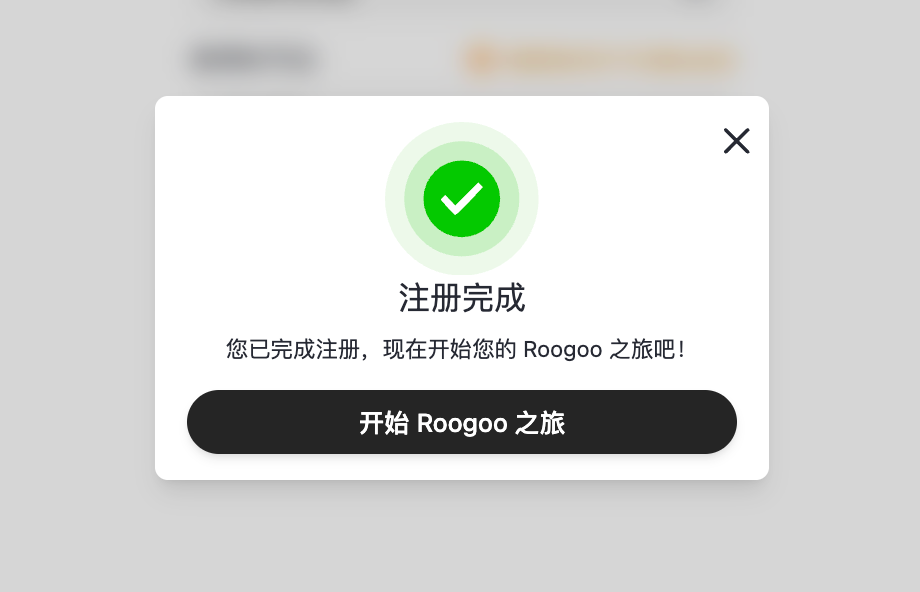

## 二、开卡

注册之后直接登录，前往主页，点击免费申请卡片。

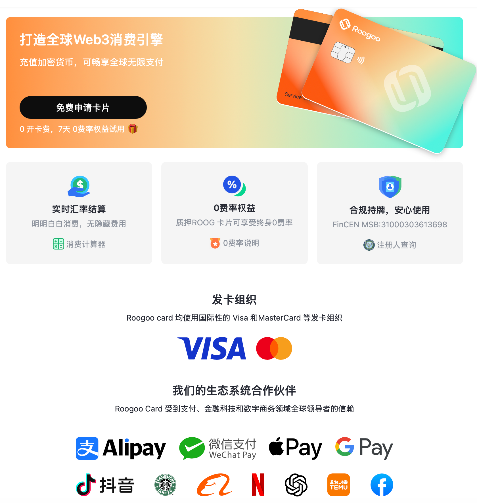

选择卡片类型。

> **注意：**
>
> - 美区付款请选择乐享卡。
> - AI 付费订阅必须开乐享卡。
> - 港区付款请选择无界卡。

限时 0 开卡费，需要首冲 10U，也就是 10 美金。这张卡可以绑定微信或者支付宝直接消费，所以冲进去的 10 美金就是自己的钱，不用担心没地方花。

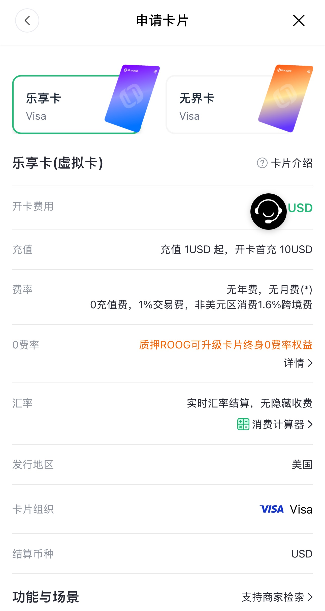

## 三、充值

充值美金需要用到数字钱包提现，选择网络后进行链上充值。此处参考：[使用欧易充值](https://help.roogoo.com/zh-CN/articles/11761276-%E9%80%9A%E8%BF%87%E6%AC%A7%E6%98%93-okx-%E6%95%B0%E5%AD%97%E8%B4%A7%E5%B8%81%E4%BA%A4%E6%98%93%E6%89%80%E8%B4%AD%E4%B9%B0usdt%E7%A8%B3%E5%AE%9A%E5%B8%81%E6%8C%87%E5%8D%97)，欧易支持 RMB 换 USDT。

充值到账后直接点击开通卡片。系统会要求实名认证，直接选择 Sumsub 快捷认证。这个认证平台是国际专门做 KYC 认证的平台，无需担心隐私问题。

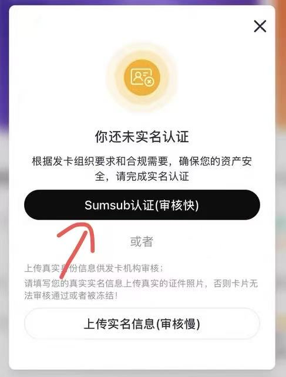

实名认证完毕后需要点击完成，然后去开通卡片。开通卡片仍然从首页进入，在「卡片」里添加卡片。添加卡片时会提示充值金额，填写 10 刀即可。开通成功后会看到如下页面。

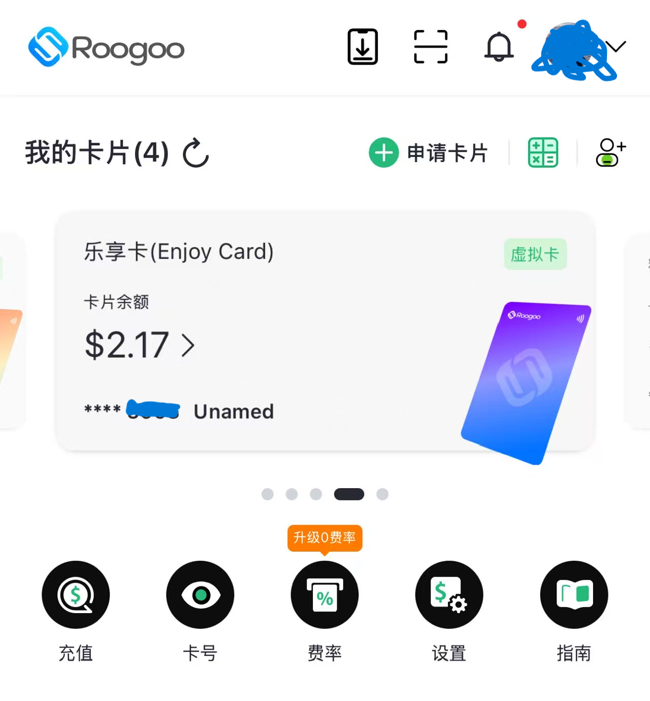

## 四、卡片明细

点击小眼睛查看卡号，获取验证码后即可看到卡片的卡号、到期时间、CVV 安全码。

> **安全提醒：** 这里面的内容就是卡片的卡号和密码，切记不要分享给任何人，以免造成资金被盗。

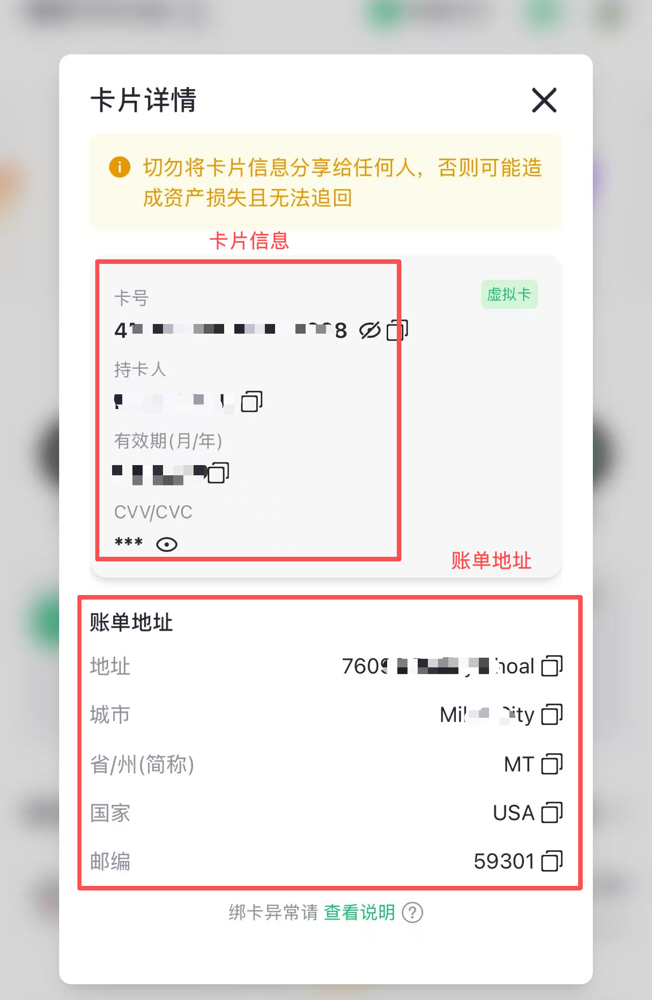

### 特别注意

> **卡片如果多次被拒，或卡内余额不足还继续进行消费，卡片将会被冻结，同时还将收取拒付费，一定要注意。**

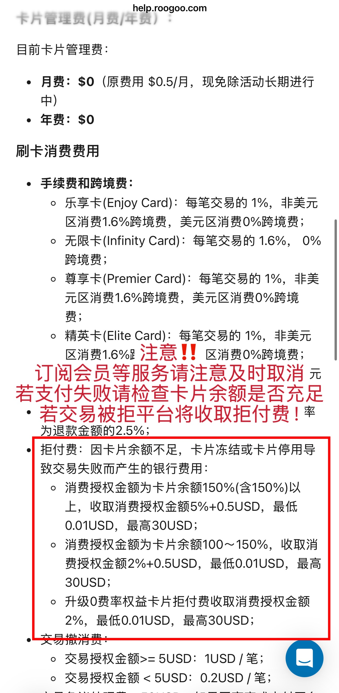

**以下为申请须知，务必仔细阅读观看。**

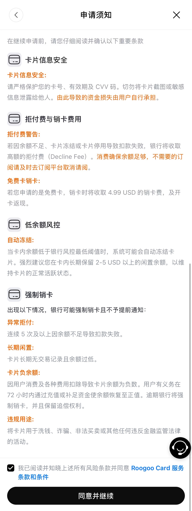

## 五、卡片使用

> **卡片不支持 0 元试用，仅支持正常付费订阅。**

亲测此卡可以绑定 Apple Pay、Google Pay、ChatGPT、PayPal、微信、支付宝、美团等各种平台。绑定过程只需要输入卡号、到期时间、CVV 即可完成绑定消费。

### 支付宝

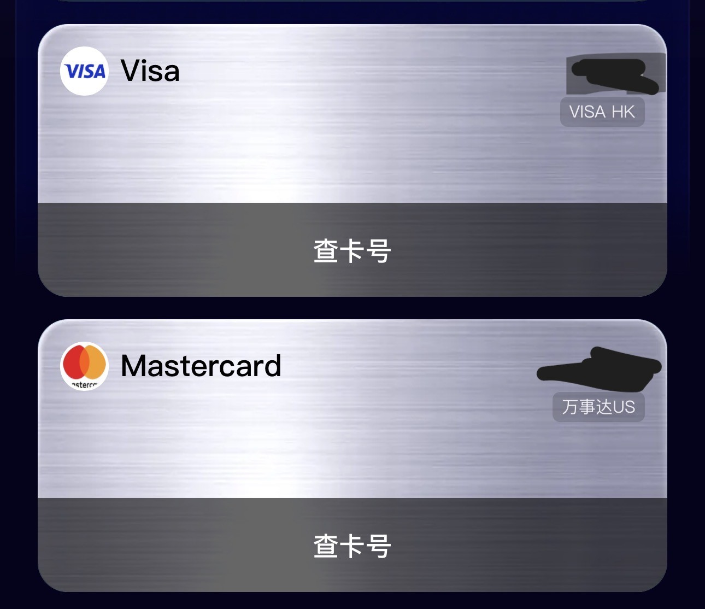

### 微信

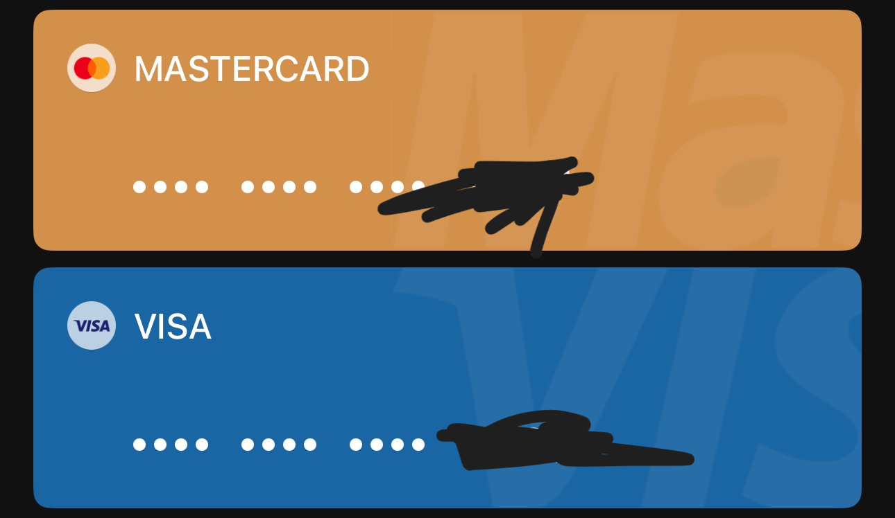

### Apple Pay

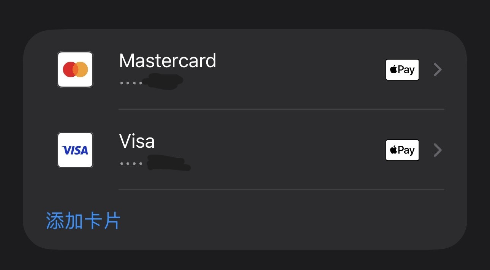

### Google Pay

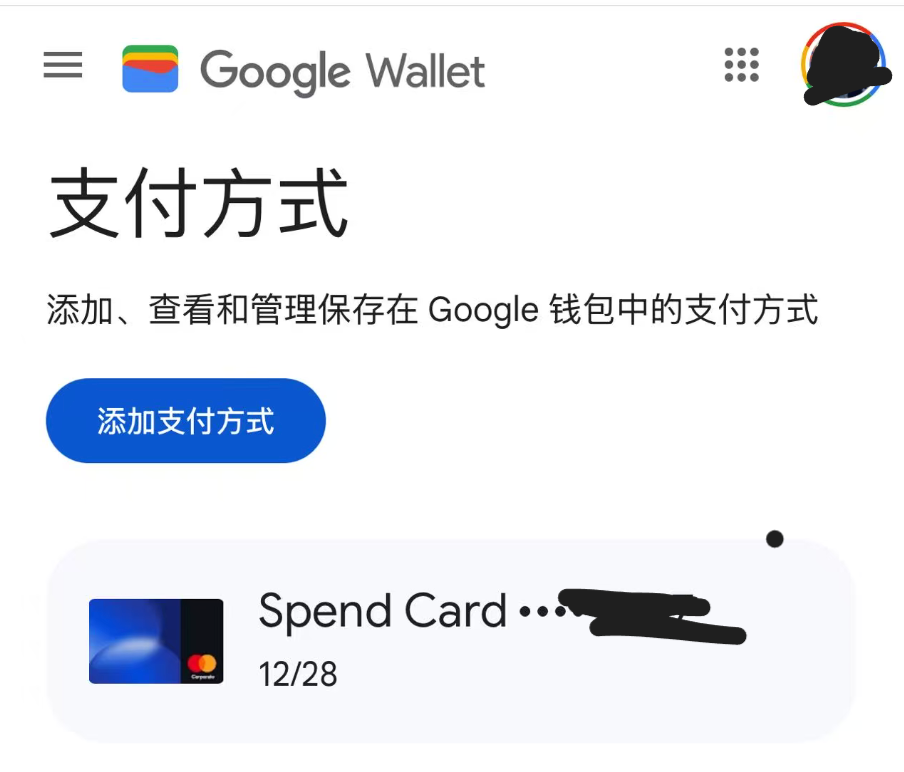

### PayPal

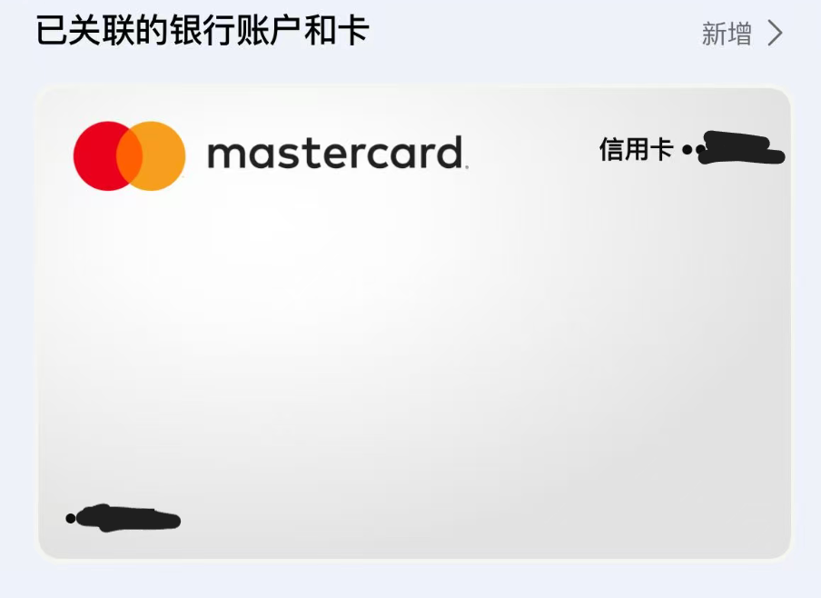

### 美团

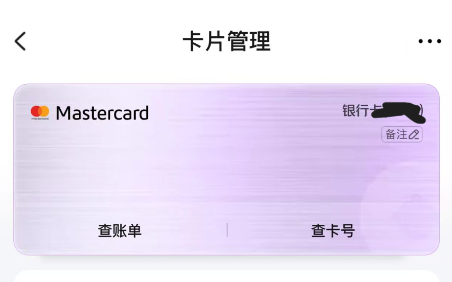

以下场景均支持绑定、消费：

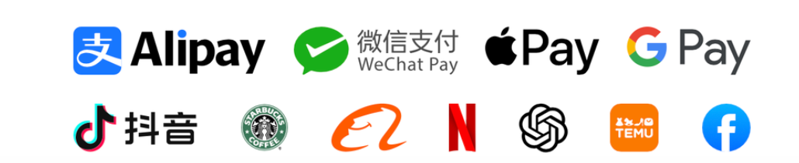
