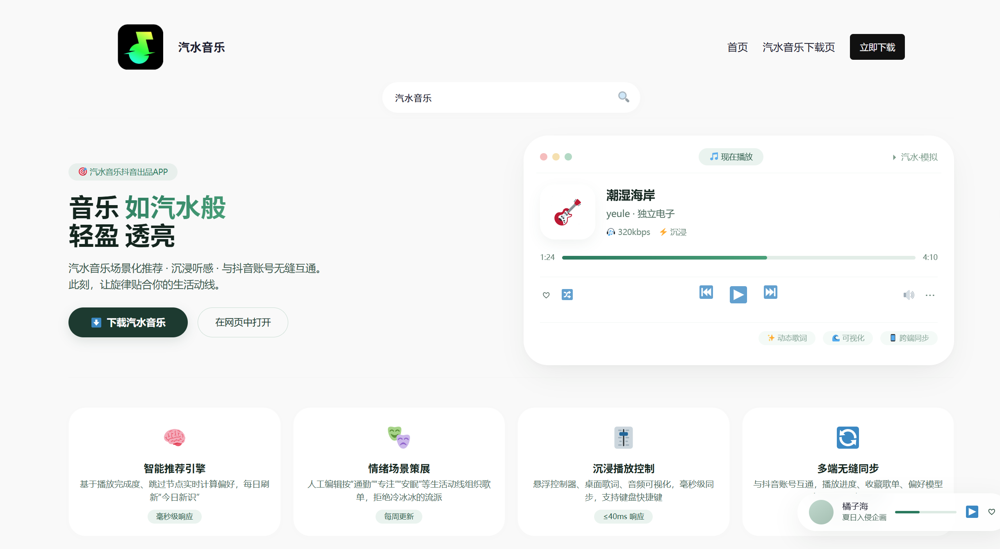
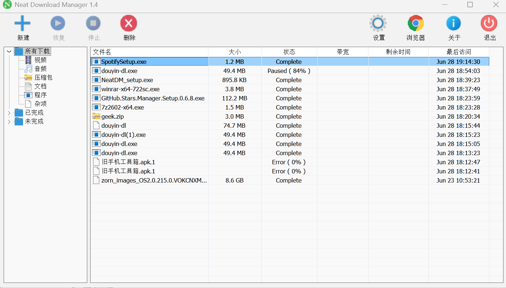
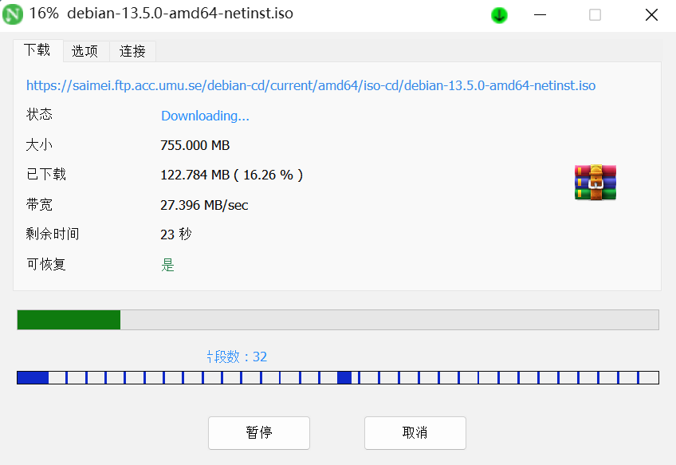
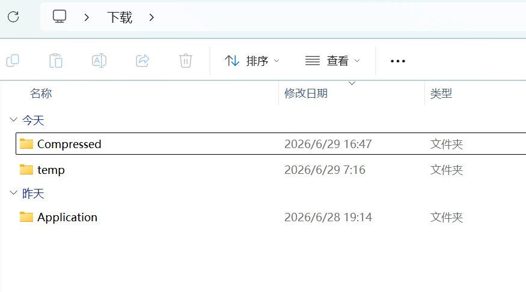
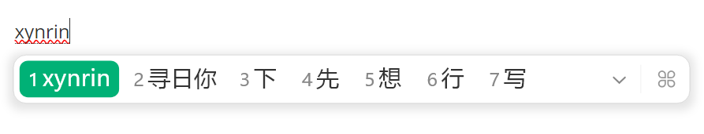
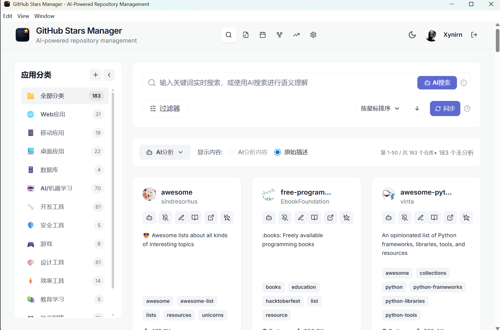

## 前言

在日常生活中，我们的电脑经常需要进行 `生产工作`，这时候一些工具对我们来说很有必要，因为工具能够提升我们的生产效率。

### 为什么要写这篇文章

随着互联网的发展，我们已经进入了 AI 时代，信息的便捷化使得一些人丰富了自身的生活体验。然而随着越来越多的小白用户大量使用电脑，一些 `黑客` 盯上了他们，想通过 `银狐病毒` 把小白的电脑制成 `肉鸡`。

> 真的汽水官方网站

> 假的汽水网站

如上图所示，小白在下载软件时往往无法分辨真正的官网。在生产环境中最怕的就是下载到不干净的东西，造成严重的损失，因此找到官方网站很有必要。

## 工具推荐

由于本人只有 Windows 的生产电脑，所以此篇文章只讲本人使用过的 Windows 端工具。

在此帖子中，我会介绍生产力工具的使用场景、功能，同时附带使用界面截图，让你快速了解这是一个什么样的工具。

### 1.1 [NeatDownloadManager](https://www.neatdownloadmanager.com/index.php/en/)——多线程下载工具

在日常下载文件的时候，我们通常会因为网络波动而烦恼。有时候即使你家的 WiFi 上行宽带非常高，也难免会出现一些 `网络波动`。如果在下载软件时突然断开，对浏览器下载来说就必须重新下载，这非常消耗我们的生产时间。而这个工具支持 `断点续传`（关机和重启后还能继续下载），也支持 `分段下载`（将一个文件拆成许多份分别下载，全部下载完成后再进行合并）。

**界面展示**：

> 这是主界面，点击桌面图标后出现的界面

> 这是下载界面。当我们从浏览器选择对应的文件并下载时，这个界面就会弹出来，可以看到速度非常快

**而且它还支持将下载的文件按格式或者名称进行分类**：

**总的来说，这个软件几乎是必需品，毕竟这样高效率的免费软件谁不爱呢？**

### 1.2 [LightShot](https://app.prntscr.com/zh-cn/index.html)——好用的截图软件

在日常截图中，Windows 自带的截图工具并非不好用，而是功能 `过于冗余`。一些图标有时候还容易弄混淆，甚至有些只能保存到 `剪贴板`，这就导致一些截图需要先粘贴到特殊的地方，再使用“另存为”来保存。

而这款软件支持的功能都是 `必需品`，不得不借鉴。

> 简洁明了是它的强项，快速保存是它的优势

### 1.3 [微信输入法](https://z.weixin.qq.com/)——个人认为最强最好用的输入法

在 Windows 电脑上，我们登录一些网站经常要用到手机上的验证码，这个时候这款输入法的功能就体现出来了：它支持多端 `剪贴板秒同步`，而且词语候选框非常 `有质感`，并且支持多端传输文件，再也不用打开占用内存的某 Q 某 V 来“我的电脑”或者建群传送了（关键是 `原图直传`，不压缩图片清晰度）。

**候选词预览**：

**怎么样？有没有一点 Mac 的风格？这款输入法肯定能大幅度提高你的生产效率。**

### 1.4 [GitHub Stars Manager](https://gsm.aminta.top/)——GitHub Stars 聚合查看器

在日常生活中，我们经常会收藏一些实用的 `GitHub 仓库`。但随着时间的积累，仓库越来越多，用网页查找某个 Star 过的仓库得翻半天，这时候这个软件的功能就体现出来了。

它通过你的 `GitHub API` 同步你 `Star` 过的仓库，结合搜索以及 AI 来帮你整理仓库。这是一个令人惊讶的项目，完美解决了日常上网中的需求点。

**聚合之后，再也不用去网页端翻来覆去了。**

## 留言

本帖子将持续更新，`如果你有好用的软件，请在下方评论区带截图留言`，我会将你的贡献嵌入此篇文章内！

- 最后更新于 2026-06-29
