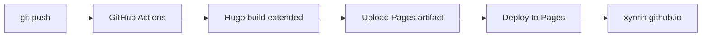

# 🚀 部署文档

> 这份文档记录从零到上线的完整部署流程。如果你（或未来的你）需要重建一遍博客，按这份走。

## 📋 一句话原理

`本地写 Markdown` → `git push 到 GitHub` → `GitHub Actions 自动 build Hugo` → `部署到 GitHub Pages` → `xynrin.github.io 更新`。

评论 / 浏览量 / 点赞由 `Waline 后端（部署在 Vercel）` 处理，数据存在 `GitHub 私有仓库 waline-data`。

---

## 🧰 本地环境

| 工具 | 版本 | 安装 |
|------|------|------|
| Hugo extended | v0.161+ | https://gohugo.io/installation/ |
| Git | any | https://git-scm.com |
| Node.js（可选） | LTS | https://nodejs.org （仅 Pages CMS 本地预览要） |

```bash
# 验证
hugo version          # 应输出 extended
git --version
```

---

## 🌐 一、GitHub 仓库

1. **博客主仓库**：`Xynrin/Xynrin.github.io`（Public，必须公开 Pages 才免费）
2. **评论数据仓库**：`Xynrin/waline-data`（Private，存评论数据）

启用 Pages：

- 打开 https://github.com/Xynrin/Xynrin.github.io/settings/pages
- **Build and deployment → Source → 选 GitHub Actions**（关键，默认是 "Deploy from branch"）

---

## 🧱 二、首次部署

```bash
# 克隆（带 submodule）
git clone --recurse-submodules https://github.com/Xynrin/Xynrin.github.io.git
cd Xynrin.github.io

# 本地预览
hugo server --buildDrafts
# 浏览器打开 http://localhost:1313
```

每次推送 main 分支，`.github/workflows/hugo.yml` 自动触发：



---

## 💬 三、评论系统（Waline + GitHub 存储）

### 后端：Vercel
**部署地址**：https://pinglun-blog.vercel.app

### 数据库：GitHub
**数据仓库**：`Xynrin/waline-data`（评论以 JSON 文件形式存放）

### Vercel 环境变量（必须配齐）

| Key | Value | 用途 |
|-----|-------|------|
| `GITHUB_TOKEN` | `ghp_xxxxxxxx` | 读写 waline-data 仓库 |
| `GITHUB_REPO` | `Xynrin/waline-data` | 数据仓库路径 |
| `GITHUB_PATH` | `comments` | 数据仓库内子目录 |
| `SITE_URL` | `https://xynrin.github.io` | 防止反垃圾 |

**Token 在哪里生成**：
- https://github.com/settings/tokens/new
- Note: `waline`
- Expiration: No expiration
- 勾选 `repo` 权限
- ⚠️ Token 创建后只能复制一次，丢了只能重新生成

**Vercel 环境变量配置位置**：
- https://vercel.com/dashboard → 项目 `pinglun-blog` → Settings → Environments → Production → Add Variable

### 前端接入（已完成）
`hugo.yaml` 里：
```yaml
params:
  comments:
    enabled: true
    provider: waline
    waline:
      serverURL: https://pinglun-blog.vercel.app
      pageview: true   # 启用浏览量统计
```

---

## 📝 四、写文章

### 方式 A：本地写

```bash
hugo new content post/your-post-slug/index.md
# 编辑文件后
hugo server --buildDrafts   # 本地预览
git add .
git commit -m "post: 你的标题"
git push
```

### 方式 B：网页 CMS

- 打开 https://app.pagescms.org
- 用 GitHub 登录授权（首次会让你装 Pages CMS App 到仓库）
- 选 `Xynrin.github.io` → 「文章」面板 → 新建
- 保存即自动 commit + 部署

### 方式 C：GitHub 网页

- 直接到仓库 `content/post/` 编辑或新建文件，commit 即触发部署

---

## 📊 五、统计与第三方服务总览

| 服务 | 用途 | 后台地址 | 备注 |
|------|------|----------|------|
| GitHub | 代码 + Pages 托管 | https://github.com/Xynrin | 主战场 |
| Pages CMS | 网页可视化写文章 | https://app.pagescms.org | 用 GitHub 登录 |
| Vercel | Waline 后端托管 | https://vercel.com/dashboard | 项目名 `pinglun-blog` |
| GitHub Token | Waline 写数据库 | https://github.com/settings/tokens | 失效需重生 |
| 不蒜子 | 全站 PV/UV | （无后台，自动统计） | https://busuanzi.ibruce.info |
| Waline | 评论 / 点赞 / 单篇浏览量 | https://pinglun-blog.vercel.app | 后台见数据见 waline-data 仓库 |
| visitor-badge | README 浏览徽章 | https://visitor-badge.laobi.icu | 公开服务 |
| shields.io | GitHub 数据徽章 | https://shields.io | 公开服务 |
| capsule-render | Profile banner 横幅 | https://capsule-render.vercel.app | 公开服务 |

---

## 🔁 六、常见操作清单

| 想做什么 | 在哪做 |
|----------|--------|
| 改主题颜色 / 样式 | `assets/scss/custom.scss` |
| 改标题 / 副标题 / 头像 | `hugo.yaml` 的 `params.sidebar` |
| 加 / 删 社交链接 | `hugo.yaml` 的 `menu.social` |
| 改 footer 文字 | `hugo.yaml` 的 `params.footer.customText` |
| 改 banner 图 | 替换 `assets/img/my-linux-do.png` |
| 改 favicon | 替换 `assets/img/favicon.png` |
| 改赞赏码 | 替换 `assets/img/zan-shang.png` |
| 改 Hero 大标语 | `hugo.yaml` 的 `params.hero` |
| 升级主题 | `cd themes/hugo-theme-stack && git pull` |

---

## 🧯 七、故障速查

| 现象 | 检查 |
|------|------|
| 网站访问 404 | Settings → Pages → Source 必须是 GitHub Actions |
| 部署成功但页面没更新 | 浏览器强刷 `Ctrl + F5` |
| 评论框不显示 | 1. Vercel 环境变量是否配在 **Production**；2. `pinglun-blog.vercel.app/api/comment` 返回 `errno:1001` 表示后端正常 |
| 评论提交失败 | GitHub Token 可能过期或丢失 repo 权限，去 https://github.com/settings/tokens 检查 |
| 不蒜子数字一直是 0 | 该服务偶尔不稳定，等几小时再看 |
| 中文徽章乱码 | shields.io 的 URL 参数里别用中文，用纯英文 |

如果整个 GitHub Actions 部署失败：去 https://github.com/Xynrin/Xynrin.github.io/actions 看 log，常见原因是 hugo.yaml 改坏了 YAML 缩进。
